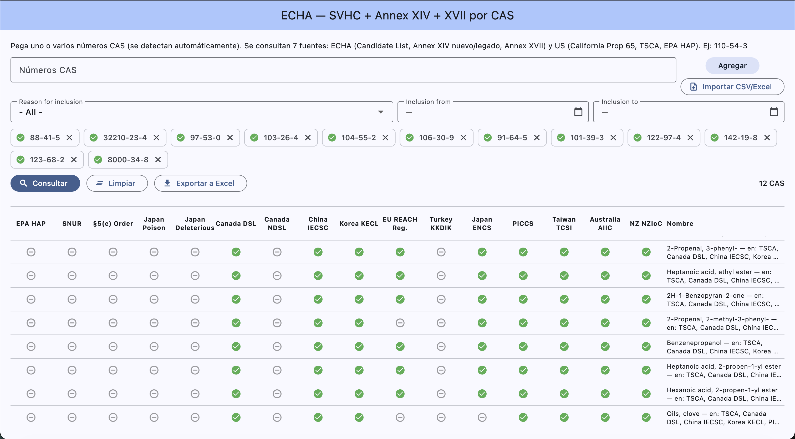

# ECHA — Consulta regulatoria por número CAS

App de escritorio (**macOS** y **Windows**) que, dado uno o varios números **CAS**,
verifica la presencia de cada sustancia en **22 listas e inventarios regulatorios**
de todo el mundo, y muestra el resultado en una tabla comparativa exportable a Excel.




🌐 **Página del proyecto:** https://lordmacu.github.io/echa-svhc/

---

## Descargas

| Plataforma | Descarga |
|---|---|
| 🍎 **macOS** | [echa_svhc-macos.dmg](https://github.com/lordmacu/echa-svhc/releases/latest/download/echa_svhc-macos.dmg) |
| 🪟 **Windows** (portable) | [echa_svhc-windows-portable.zip](https://github.com/lordmacu/echa-svhc/releases/latest/download/echa_svhc-windows-portable.zip) |

Los enlaces apuntan siempre al [último release](https://github.com/lordmacu/echa-svhc/releases/latest).
En Windows, descomprime el `.zip` y ejecuta `echa_svhc.exe` (no requiere instalación).

---

## Listas consultadas (22)

**🇪🇺 Unión Europea — ECHA**
- Candidate List (SVHC)
- Authorisation List (REACH Annex XIV) — portal nuevo (ECHA CHEM)
- Authorisation List (REACH Annex XIV) — portal legado
- Restriction List (REACH Annex XVII)

**🇺🇸 Estados Unidos**
- California Proposition 65
- TSCA Chemical Substance Inventory
- EPA Hazardous Air Pollutants (Clean Air Act)
- TSCA Significant New Use Rule (SNUR)
- TSCA § 5(e) Consent Order

**🇯🇵 Japón**
- PDSCL — Poisonous substances (毒物)
- PDSCL — Deleterious substances (劇物)
- ENCS (Existing & New Chemical Substances)

**🇨🇦 Canadá**
- Domestic Substances List (DSL)
- Non-domestic Substances List (NDSL)

**🌏 Otros (vía ChemRadar)**
- 🇨🇳 China IECSC · 🇰🇷 Korea KECL · 🇪🇺 EU REACH Registered · 🇹🇷 Turkey KKDIK
- 🇵🇭 Philippines PICCS · 🇹🇼 Taiwan TCSI · 🇦🇺 Australia AIIC · 🇳🇿 New Zealand NZIoC

---

## Características

- **Detección automática de CAS** (`2–7 dígitos - 2 dígitos - 1 dígito`), incluso al pegar texto/prosa que los contenga; se convierten en *chips* sin duplicados.
- **Importar desde archivo**: carga un `.csv`, `.txt`, `.xlsx` o `.xls` y extrae todos los CAS (de cualquier columna/hoja).
- **Tabla comparativa**: una fila por CAS, una columna por lista (✓ en lista / – no / ⚠ error). Cada fila se expande con el detalle por fuente (fecha de inclusión, motivo Art. 57, Entry No., Sunset date, condiciones…).
- **Filtros** (Candidate List): Reason for inclusion (Art. 57) y rango de fecha de inclusión.
- **Exportar a Excel**: genera un `.xlsx` con Sí/No por lista + columnas de detalle.
- **Consultas en paralelo**: las fuentes se agrupan por host y se consultan simultáneamente, respetando el *rate-limiting* de cada servidor.

---

## Cómo funciona

Cada lista se consulta con el método más fiable para su origen:

| Origen | Método |
|---|---|
| **ECHA** (Candidate, Annex XIV legado, Annex XVII) | Portal Liferay — *render GET* (`p_p_lifecycle=0`) con criterios *namespaced* + `_doSearch=true`; el campo oculto `_total` indica si está listado. |
| **ECHA CHEM** (Annex XIV nuevo) | API JSON `api-obligation-list/v1/authorisationList?searchText=<cas>`. |
| **EPA ChemView** (SNUR, § 5(e)) | `chemicals/search` → id → `chemicals/datatable` → se leen los códigos `SNUR` / `CO` en `sources`. |
| **ChemRadar** (China, Korea, REACH, Turkey, PICCS, TCSI, AIIC, NZIoC, ENCS, Prop 65, TSCA, EPA HAP) | Endpoint público `es_query` por inventario. |
| **Japón PDSCL** (NIHS) | Listas estáticas (Shift_JIS) descargadas una vez y cacheadas. |
| **Canadá DSL/NDSL** | Inventarios **locales** (Excel incluido como asset) — búsqueda instantánea, sin red. |

Detalles del reverse-engineering de ECHA en [`test.md`](test.md).

> **¿Por qué escritorio y no web?** Varias de estas APIs bloquearían las peticiones
> desde un navegador por **CORS**. Una app nativa hace peticiones HTTP crudas
> (como `curl`), sin esa restricción.

---

## Desarrollo

```bash
flutter pub get
flutter run -d macos        # o -d windows
flutter test
```

## Builds (CI)

GitHub Actions ([`.github/workflows/build.yml`](.github/workflows/build.yml))
compila en cada push a `main` y publica como *artifacts*. Al crear un **tag**
`vX.Y.Z`, los binarios se adjuntan a un **GitHub Release**:

```bash
git tag v1.4.0
git push origin v1.4.0
```

---

## Aviso

Esta herramienta es una ayuda de *screening* y no sustituye la verificación
oficial en las fuentes regulatorias. Algunas listas (p. ej. sustancias
confidenciales bajo TSCA) no son consultables por CAS público. El portal legado
de ECHA se mantiene hasta **julio 2026**.
